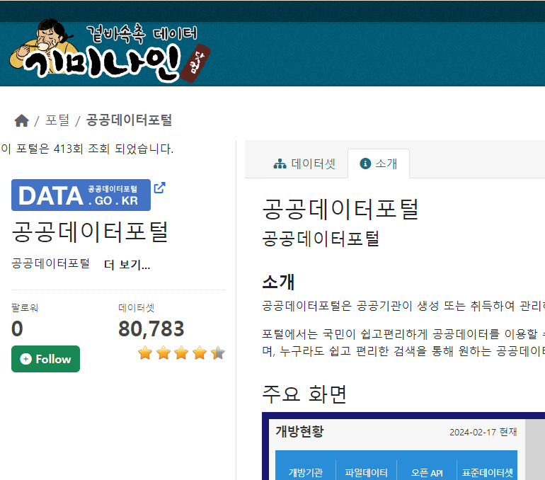
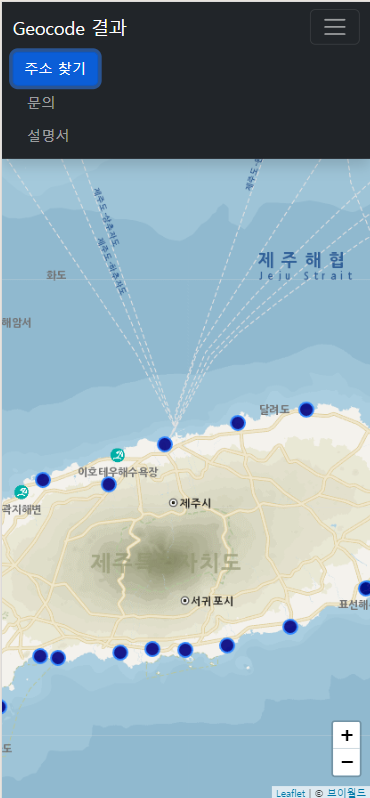

# [대한민국 오픈데이터 서비스](https://www.gimi9.com) 

바로가기: https://www.gimi9.com

오픈데이터(공공데이터 + 민간데이터) 검색 서비스입니다.

주 1회 업데이트 합니다.

질문이 있는 경우 언제든지 [GitHub 토론](https://github.com/gisman/public-data/discussions)을 통해 커뮤니티에 문의하세요.

페이스북 페이지: https://facebook.com/gimi9.page
카톡 오픈 채팅방: https://open.kakao.com/o/gNplQr7f


## 2024년 2월

* 홈페이지 리뉴얼 오픈
  * 회원 가입, 소셜(구글, 카카오) 로그인
  * 포털, 그룹, 데이터셋을 Follow 하고 내 페이지에서 보기
  * 별점, 댓글
* 원본 포털로 가기 링크, 포털에 대한 설명과 장단점 추가
    {: width="300" height="300"){: .center}
* 지오코딩 개선: 스마트폰에서도 볼 수 있습니다. 정확도를 juso.go.kr 과 거의 같은 수준으로 개선
    
* 데이터셋 화면에 연관데이터셋을 보여줍니다.
* 리소스 화면 개선
  * 펼치기/접기로 보기 좋게 개선
  * 컬럼정보에 샘플 데이터 추가
  * 컬럼 구분자, 위치정보가 포함된 컬럼명, 좌표계 정보 추가
  * 테이블 미리보기 건수를 20에서 100건으로 확대
* [빅데이터 그룹](https://gimi9.com/group/bigdata/) 업데이트: 파일 크기가 100MB 이상 또는 Row가 10만건 이상인 데이터셋을 모았습니다. 샘플 파일만 수집할 수 있는 경우, 메타데이터(설명)의 파일 크기로 판단 합니다.
* [AI 그룹](https://gimi9.com/group/ai/) 추가: AI 관련 데이터셋(주로 학습데이터)을 모았습니다.
* 실험: 해외 데이터셋(미국 공공데이터 포털) 추가

1. 공공데이터포털	(80,783 데이터셋)
1. 유통 빅데이터	(19,393 데이터셋)
1. 대구광역시	(15,060 데이터셋)
1. 금융데이터거래소	(13,079 데이터셋)
1. 미국	(9,727 데이터셋)
1. 서울특별시	(8,135 데이터셋)
1. 경기도	(4,749 데이터셋)
1. 충청남도	(4,513 데이터셋)
1. 인천광역시	(4,488 데이터셋)
1. 소방안전 빅데이터	(3,459 데이터셋)
1. 경상남도	(3,154 데이터셋)
1. 부산광역시	(2,773 데이터셋)
1. 전라북도	(2,650 데이터셋)
1. 데이터 스토어	(2,540 데이터셋)
1. 헬스케어 빅데이터	(2,021 데이터셋)
1. 지역경제 빅데이터	(1,677 데이터셋)
1. 라이프로그 빅데이터	(1,408 데이터셋)
1. 문화 빅데이터	(1,398 데이터셋)
1. 제주도	(1,301 데이터셋)
1. 농식품 빅데이터	(1,218 데이터셋)
1. 해양수산 빅데이터	(1,172 데이터셋)
1. 환경 빅데이터	(1,091 데이터셋)
1. 교통데이터 오픈마켓	(1,005 데이터셋)
1. 농림축산식품 공공데이터	(904 데이터셋)
1. 국가공간정보포털	(815 데이터셋)
1. 산림 빅데이터	(786 데이터셋)
1. 디지털 산업혁신 빅데이터	(772 데이터셋)
1. AI 허브	(752 데이터셋)
1. 통신 빅데이터	(696 데이터셋)
1. 중소기업 빅데이터	(664 데이터셋)
1. 공간융합 빅데이터 플랫폼	(662 데이터셋)
1. 브이월드	(621 데이터셋)
1. 광주 빅데이터	(605 데이터셋)
1. 강원도	(498 데이터셋)
1. 스마트치안 빅데이터	(462 데이터셋)
1. 연안 빅데이터 플랫폼	(423 데이터셋)
1. 금융 빅데이터	(400 데이터셋)
1. 스마트팜 빅데이터 플랫폼	(380 데이터셋)
1. 서울특별시 빅데이터	(319 데이터셋)
1. 부산 빅데이터	(319 데이터셋)
1. 경상북도	(315 데이터셋)
1. 감염병 빅데이터 플랫폼	(266 데이터셋)
1. 고속도로 공공데이터 포털	(245 데이터셋)
1. 데이터안심구역	(243 데이터셋)
1. 쿠콘 API	(196 데이터셋)
1. 부동산 빅데이터 플랫폼	(183 데이터셋)
1. 데이터루트 KB 카드	(95 데이터셋)
1. 카톨릭병원 빅데이터	(66 데이터셋)
1. 모두의 말뭉치	(63 데이터셋)
1. 통계데이터센터	(50 데이터셋)
1. 공간빅데이터분석 플랫폼	(41 데이터셋)
1. 한국관광 Data Lab	(40 데이터셋)
1. 인허가	(36 데이터셋)
1. 데이터스 롯데카드	(25 데이터셋)
1. 택지정보	(17 데이터셋)
1. 피타그래프	(13 데이터셋)
1. 무역투자 빅데이터	(10 데이터셋)

## 2024년 1월
* 광주광역시 빅데이터 통합 플랫폼 추가
* 충남데이터포털 올담 추가
* 브이월드 추가
* 인천광역시 포털 리뉴얼 반영

1. 공공데이터포털	(80,413 데이터셋)
1. 금융데이터거래소	(28,870 데이터셋)
1. 유통 빅데이터	(19,250 데이터셋)
1. 대구광역시	(15,027 데이터셋)
1. 서울특별시	(8,134 데이터셋)
1. 경기도	(4,595 데이터셋)
1. 충청남도	(4,509 데이터셋)
1. 인천광역시	(4,453 데이터셋)
1. 소방안전 빅데이터	(3,455 데이터셋)
1. 경상남도	(3,148 데이터셋)
1. 부산광역시	(2,983 데이터셋)
1. 데이터 스토어	(2,540 데이터셋)
1. 전라북도	(2,279 데이터셋)
1. 헬스케어 빅데이터	(2,021 데이터셋)
1. 지역경제 빅데이터	(1,646 데이터셋)
1. 라이프로그 빅데이터	(1,400 데이터셋)
1. 문화 빅데이터	(1,398 데이터셋)
1. 제주도	(1,250 데이터셋)
1. 해양수산 빅데이터	(1,172 데이터셋)
1. 농식품 빅데이터	(1,127 데이터셋)
1. 환경 빅데이터	(1,089 데이터셋)
1. 교통데이터 오픈마켓	(1,003 데이터셋)
1. 농림축산식품 공공데이터	(904 데이터셋)
1. 국가공간정보포털	(815 데이터셋)
1. 산림 빅데이터	(786 데이터셋)
1. 디지털 산업혁신 빅데이터	(771 데이터셋)
1. AI 허브	(752 데이터셋)
1. 통신 빅데이터	(696 데이터셋)
1. 중소기업 빅데이터	(663 데이터셋)
1. 공간융합 빅데이터 플랫폼	(662 데이터셋)
1. 브이월드	(617 데이터셋)
1. 광주 빅데이터	(575 데이터셋)
1. 강원도	(498 데이터셋)
1. 스마트치안 빅데이터	(462 데이터셋)
1. 연안 빅데이터 플랫폼	(423 데이터셋)
1. 금융 빅데이터	(400 데이터셋)
1. 스마트팜 빅데이터 플랫폼	(380 데이터셋)
1. 부산 빅데이터	(319 데이터셋)
1. 서울특별시 빅데이터	(318 데이터셋)
1. 경상북도	(315 데이터셋)
1. 감염병 빅데이터 플랫폼	(266 데이터셋)
1. 고속도로 공공데이터 포털	(245 데이터셋)
1. 데이터안심구역	(222 데이터셋)
1. 쿠콘 API	(196 데이터셋)
1. 부동산 빅데이터 플랫폼	(183 데이터셋)
1. 데이터루트 KB 카드	(95 데이터셋)
1. 카톨릭병원 빅데이터	(66 데이터셋)
1. 모두의 말뭉치	(62 데이터셋)
1. 통계데이터센터	(50 데이터셋)
1. 공간빅데이터분석 플랫폼	(41 데이터셋)
1. 한국관광 Data Lab	(40 데이터셋)
1. 인허가	(36 데이터셋)
1. 데이터스 롯데카드	(25 데이터셋)
1. 택지정보	(17 데이터셋)
1. 피타그래프	(13 데이터셋)
1. 무역투자 빅데이터	(10 데이터셋)

## 2023년 11월
* 회원 가입 비활성화

## 2023년 10월
* 전라북도 빅데이터 허브 리뉴얼 반영
* 부산 빅데이터 포털 download 오류 수정
* hwp 미리보기 개선

## 2023년 9월

* LINK 타입의 리소스를 HTML로 변경
* 고속도로 공공데이터 포털 추가
* 경기도 통계 데이터 2,780건 추가
* 연안빅데이터 플랫폼 데이터셋 url 오류 수정

## 2023년 8월

* 경북 공공데이터포털 서비스 중지
* Profile-report 버전업: ydata-profiling 4.5.1

## 2023년 7월

* version 표준화
* 라이프로그 빅데이터 미리보기 오류 수정
* 데이터안심구역(dsz.kdata.or.kr) 추가

## 2023년 6월

* 소방안전 빅데이터 엑셀파일 첫 줄 skip, geocode 오류 수정 (첫 줄을 비워두는 특이한 구조)
* 컬럼 정보 누락 오류 수정
* 강원특별자치도 명칭 변경 Geocoder 반영

## 2023년 5월

* Profile-report 버전업: pandas_profiling 3.2.0 -> 3.6.6

## 2023년 4월

* 부산 빅데이터 리소스 ETL 오류 수정
* 교통데이터오픈마켓 크롤링 수정, 구버전 삭제
* 감염병 빅데이터 플랫폼 추가
* 스마트팜 빅데이터 플랫폼 추가
* 연안 빅데이터 플랫폼 추가
* 부동산 빅데이터 플랫폼 추가
* 공간융합 빅데이터 플랫폼 추가
* 공간빅데이터분석 플랫폼 추가
* 통계데이터센터 추가
* 피타그래프 추가
* 데이터스 (롯데카드) 추가
* 데이터루트 (KB 카드) 추가

## 2023년 3월

웹표준 준수, 웹브라우저 호환성 개선

## 2023년 2월

* 소방안전빅데이터 수집 현행화 (사이트 업데이트)
* 제주빅데이터허브 수집 오류 수정
* 데이터 스토어 서비스 종료 (당분간 기미나인에서 검색되도록 유지)

1. 공공데이터포털	(69,094 데이터셋)
1. 유통 빅데이터	(15,931 데이터셋)
1. 대구광역시	(12,913 데이터셋)
1. 서울특별시	(7,516 데이터셋)
1. 인천광역시	(3,276 데이터셋)
1. 부산광역시	(2,747 데이터셋)
1. 경상남도	(2,723 데이터셋)
1. 헬스케어 빅데이터	(2,486 데이터셋)
1. 소방안전 빅데이터	(2,279 데이터셋)
1. 금융데이터거래소	(2,087 데이터셋)
1. 전라북도	(1,932 데이터셋)
1. 경기도	(1,567 데이터셋)
1. 문화 빅데이터	(1,334 데이터셋)
1. 제주도	(1,239 데이터셋)
1. 지역경제 빅데이터	(1,231 데이터셋)
1. 라이프로그 빅데이터	(1,196 데이터셋)
1. 해양수산 빅데이터	(1,088 데이터셋)
1. 환경 빅데이터	(1,086 데이터셋)
1. 농림축산식품 공공데이터	(864 데이터셋)
1. 농식품 빅데이터	(845 데이터셋)
1. 교통데이터거래소	(816 데이터셋)
1. 국가공간정보포털	(813 데이터셋)
1. 디지털 산업혁신 빅데이터	(770 데이터셋)
1. 산림 빅데이터	(764 데이터셋)
1. 통신 빅데이터	(696 데이터셋)
1. 중소기업 빅데이터	(665 데이터셋)
1. 스마트치안 빅데이터	(456 데이터셋)
1. AI 허브	(434 데이터셋)
1. 금융 빅데이터	(403 데이터셋)
1. 서울특별시 빅데이터	(369 데이터셋)
1. 경상북도	(315 데이터셋)
1. 부산 빅데이터	(309 데이터셋)
1. 쿠콘 API	(196 데이터셋)
1. 카톨릭병원 빅데이터	(130 데이터셋)
1. 한국관광 Data Lab	(40 데이터셋)
1. 인허가	(36 데이터셋)
1. 택지정보	(17 데이터셋)
1. 무역투자 빅데이터	(10 데이터셋)
1. 기미나인	(2 데이터셋)


## 2023년 1월

1. 공공데이터포털	(68,527 데이터셋)
1. 유통 빅데이터	(15,610 데이터셋)
1. 대구광역시	(12,679 데이터셋)
1. 서울특별시	(7,511 데이터셋)
1. 인천광역시	(3,259 데이터셋)
1. 부산광역시	(2,738 데이터셋)
1. 경상남도	(2,720 데이터셋)
1. 데이터 스토어	(2,548 데이터셋)
1. 헬스케어 빅데이터	(2,461 데이터셋)
1. 소방안전 빅데이터	(2,215 데이터셋)
1. 금융데이터거래소	(2,087 데이터셋)
1. 전라북도	(1,932 데이터셋)
1. 경기도	(1,562 데이터셋)
1. 문화 빅데이터	(1,307 데이터셋)
1. 지역경제 빅데이터	(1,231 데이터셋)
1. 라이프로그 빅데이터	(1,196 데이터셋)
1. 제주도	(1,177 데이터셋)
1. 해양수산 빅데이터	(1,088 데이터셋)
1. 환경 빅데이터	(1,083 데이터셋)
1. 농림축산식품 공공데이터	(864 데이터셋)
1. 농식품 빅데이터	(845 데이터셋)
1. 국가공간정보포털	(813 데이터셋)
1. 교통데이터거래소	(791 데이터셋)
1. 디지털 산업혁신 빅데이터	(770 데이터셋)
1. 산림 빅데이터	(764 데이터셋)
1. 통신 빅데이터	(696 데이터셋)
1. 중소기업 빅데이터	(658 데이터셋)
1. 강원도	(498 데이터셋)
1. 스마트치안 빅데이터	(456 데이터셋)
1. AI 허브	(434 데이터셋)
1. 금융 빅데이터	(403 데이터셋)
1. 서울특별시 빅데이터	(369 데이터셋)
1. 경상북도	(315 데이터셋)
1. 부산 빅데이터	(308 데이터셋)
1. 쿠콘 API	(196 데이터셋)
1. 카톨릭병원 빅데이터	(130 데이터셋)
1. 한국관광 Data Lab	(40 데이터셋)
1. 인허가	(36 데이터셋)
1. 택지정보	(17 데이터셋)
1. 무역투자 빅데이터	(10 데이터셋)
1. 기미나인	(2 데이터셋)

## 2022년 12월

* 데이터바우처 상품 등록: [상품 상세 정보](http://kdata.or.kr/datavoucher/is/selectPortalFileDetail.do?rcpnYear=2023&brno=3778701405&sprnSctrCd=P01014002&prdcId=&sprnDsncCd=P11014001)


## 2022년 11월

* 공공데이터 URL 검색: [기미나인 완전 꿀팁! 이거 한 방이면 검색이 편해집니다.](https://blog.naver.com/gimi9-blog/222931657054)
* 유료/무료 분류 필터: [미쳐버린 편리함으로 유료 데이터를 순삭시키는 레전드 필터 등장](https://blog.naver.com/gimi9-blog/222936676860) 

1. 공공데이터포털	(66,116 데이터셋)
1. 유통 빅데이터	(15,111 데이터셋)
1. 대구광역시	(12,183 데이터셋)
1. 서울특별시	(7,491 데이터셋)
1. 인천광역시	(3,237 데이터셋)
1. 부산광역시	(2,720 데이터셋)
1. 데이터 스토어	(2,548 데이터셋)
1. 경상남도	(2,540 데이터셋)
1. 헬스케어 빅데이터	(2,441 데이터셋)
1. 금융데이터거래소	(2,087 데이터셋)
1. 전라북도	(1,932 데이터셋)
1. 소방안전 빅데이터	(1,866 데이터셋)
1. 경기도	(1,544 데이터셋)
1. 문화 빅데이터	(1,303 데이터셋)
1. 지역경제 빅데이터	(1,230 데이터셋)
1. 라이프로그 빅데이터	(1,196 데이터셋)
1. 제주도	(1,177 데이터셋)
1. 해양수산 빅데이터	(1,084 데이터셋)
1. 환경 빅데이터	(1,065 데이터셋)
1. 농림축산식품 공공데이터	(864 데이터셋)
1. 농식품 빅데이터	(841 데이터셋)
1. 국가공간정보포털	(813 데이터셋)
1. 교통데이터거래소	(786 데이터셋)
1. 디지털 산업혁신 빅데이터	(766 데이터셋)
1. 산림 빅데이터	(752 데이터셋)
1. 통신 빅데이터	(696 데이터셋)
1. 중소기업 빅데이터	(658 데이터셋)
1. 부산 빅데이터	(598 데이터셋)
1. 강원도	(498 데이터셋)
1. AI 허브	(434 데이터셋)
1. 금융 빅데이터	(395 데이터셋)
1. 스마트치안 빅데이터	(393 데이터셋)
1. 서울특별시 빅데이터	(369 데이터셋)
1. 경상북도	(315 데이터셋)
1. 쿠콘 API	(196 데이터셋)
1. 카톨릭병원 빅데이터	(130 데이터셋)
1. 한국관광 Data Lab	(40 데이터셋)
1. 인허가	(36 데이터셋)
1. 택지정보	(17 데이터셋)
1. 무역투자 빅데이터	(10 데이터셋)
1. 기미나인	(2 데이터셋)

## 2022년 10월

* aihub의 외부 기관 데이터 47건 추가
* 부산, 경남, 대구 공공데이터의 author 수정
* AWS로 CKAN 서버 이전
* 리소스 페이지에 컬럼 목록 표시

1. 공공데이터포털	(64,810 데이터셋)
1. 유통 빅데이터	(14,682 데이터셋)
1. 대구광역시	(11,915 데이터셋)
1. 서울특별시	(7,173 데이터셋)
1. 인천광역시	(3,170 데이터셋)
1. 부산광역시	(2,715 데이터셋)
1. 데이터 스토어	(2,548 데이터셋)
1. 경상남도	(2,512 데이터셋)
1. 헬스케어 빅데이터	(2,408 데이터셋)
1. 금융데이터거래소	(2,087 데이터셋)
1. 전라북도	(1,932 데이터셋)
1. 소방안전 빅데이터	(1,667 데이터셋)
1. 경기도	(1,539 데이터셋)
1. 문화 빅데이터	(1,294 데이터셋)
1. 제주도	(1,177 데이터셋)
1. 환경 빅데이터	(1,020 데이터셋)
1. 지역경제 빅데이터	(985 데이터셋)
1. 해양수산 빅데이터	(980 데이터셋)
1. 라이프로그 빅데이터	(924 데이터셋)
1. 농림축산식품 공공데이터	(864 데이터셋)
1. 국가공간정보포털	(813 데이터셋)
1. 농식품 빅데이터	(812 데이터셋)
1. 교통데이터거래소	(773 데이터셋)
1. 산림 빅데이터	(752 데이터셋)
1. 통신 빅데이터	(696 데이터셋)
1. 디지털 산업혁신 빅데이터	(693 데이터셋)
1. 중소기업 빅데이터	(655 데이터셋)
1. 부산 빅데이터	(598 데이터셋)
1. 강원도	(498 데이터셋)
1. AI 허브	(432 데이터셋)
1. 금융 빅데이터	(395 데이터셋)
1. 스마트치안 빅데이터	(380 데이터셋)
1. 서울특별시 빅데이터	(369 데이터셋)
1. 경상북도	(315 데이터셋)
1. 쿠콘 API	(196 데이터셋)
1. 카톨릭병원 빅데이터	(130 데이터셋)
1. 한국관광 Data Lab	(40 데이터셋)
1. 인허가	(36 데이터셋)
1. 택지정보	(17 데이터셋)
1. 무역투자 빅데이터	(10 데이터셋)
1. 기미나인	(3 데이터셋)

## 2022년 9월

* HWP 미리보기
* PDF 미리보기
* ai-hub 추가
* 부산빅데이터 추가
* 조직 명칭 수정: 카톨릭, 서울 빅데이터 등 통일성 있고 의미 알기 쉽게.
* naver 블로그 링크 추가. "공공데이터 뉴스" 메뉴에 연결됩니다. https://blog.naver.com/gimi9-blog
* resource 다운로드 url 제거. 원본 사이트에서 다운로드 하세요.
* (인기) 유용한 데이터 제공처 소개페이지: https://gimi9.com/dataset/portal_etc

1. 공공데이터포털	(64,230 데이터셋)
1. 유통 빅데이터	(14,298 데이터셋)
1. 대구광역시	(11,691 데이터셋)
1. 서울특별시	(7,169 데이터셋)
1. 인천광역시	(3,065 데이터셋)
1. 부산광역시	(2,703 데이터셋)
1. 데이터 스토어	(2,548 데이터셋)
1. 경상남도	(2,478 데이터셋)
1. 헬스케어 빅데이터	(2,388 데이터셋)
1. 금융데이터거래소	(2,087 데이터셋)
1. 전라북도	(1,932 데이터셋)
1. 소방안전 빅데이터	(1,611 데이터셋)
1. 경기도	(1,534 데이터셋)
1. 문화 빅데이터	(1,285 데이터셋)
1. 제주도	(1,177 데이터셋)
1. 환경 빅데이터	(1,020 데이터셋)
1. 지역경제 빅데이터	(985 데이터셋)
1. 농림축산식품 공공데이터	(864 데이터셋)
1. 국가공간정보포털	(813 데이터셋)
1. 농식품 빅데이터	(799 데이터셋)
1. 교통데이터거래소	(772 데이터셋)
1. 해양수산 빅데이터	(761 데이터셋)
1. 산림 빅데이터	(752 데이터셋)
1. 통신 빅데이터	(696 데이터셋)
1. 중소기업 빅데이터	(655 데이터셋)
1. 디지털 산업혁신 빅데이터	(651 데이터셋)
1. 라이프로그 빅데이터	(615 데이터셋)
1. 강원도	(498 데이터셋)
1. 금융 빅데이터	(390 데이터셋)
1. AI 허브	(384 데이터셋)
1. 서울특별시 빅데이터	(369 데이터셋)
1. 스마트치안 빅데이터	(360 데이터셋)
1. 경상북도	(315 데이터셋)
1. 부산 빅데이터	(303 데이터셋)
1. 쿠콘 API	(196 데이터셋)
1. 카톨릭병원 빅데이터	(130 데이터셋)
1. 한국관광 Data Lab	(40 데이터셋)
1. 인허가	(36 데이터셋)
1. 택지정보	(17 데이터셋)
1. 무역투자 빅데이터	(10 데이터셋)
1. 기미나인	(2 데이터셋)

## 2022년 8월

* 디지털 산업혁신 빅데이터(https://www.bigdata-dx.kr/) 샘플 미리보기
* 환경 빅데이터 플랫폼(https://www.bigdata-environment.kr/) 샘플 미리보기
* 카톨릭빅데이터통합센터(https://cmcdata.net/) 샘플 미리보기
* 사용 설명서 추가: https://gisman.github.io/public-data/
* 공공데이터 뉴스 추가: https://gimi9.blogspot.com/

1. 공공데이터포털	(62,465 데이터셋)
1. 유통 빅데이터	(13,974 데이터셋)
1. 대구광역시	(11,455 데이터셋)
1. 서울특별시	(7,150 데이터셋)
1. 인천광역시	(2,869 데이터셋)
1. 부산광역시	(2,694 데이터셋)
1. 데이터 스토어	(2,548 데이터셋)
1. 헬스케어 빅데이터	(2,379 데이터셋)
1. 경상남도	(2,324 데이터셋)
1. 금융데이터거래소	(2,087 데이터셋)
1. 전라북도	(1,932 데이터셋)
1. 경기도	(1,529 데이터셋)
1. 소방안전 빅데이터	(1,516 데이터셋)
1. 문화 빅데이터	(1,278 데이터셋)
1. 환경 빅데이터	(1,020 데이터셋)
1. 제주도	(1,017 데이터셋)
1. 지역경제 빅데이터	(985 데이터셋)
1. 농림축산식품 공공데이터	(847 데이터셋)
1. 국가공간정보포털	(795 데이터셋)
1. 농식품 빅데이터	(777 데이터셋)
1. 교통 빅데이터	(766 데이터셋)
1. 해양수산 빅데이터	(761 데이터셋)
1. 산림 빅데이터	(752 데이터셋)
1. 통신 빅데이터	(696 데이터셋)
1. 중소기업 빅데이터	(655 데이터셋)
1. 디지털 산업혁신 빅데이터	(621 데이터셋)
1. 라이프로그 빅데이터	(547 데이터셋)
1. 강원도	(498 데이터셋)
1. 금융 빅데이터	(390 데이터셋)
1. 서울특별시 빅데이터 캠퍼스	(369 데이터셋)
1. 스마트치안 빅데이터	(360 데이터셋)
1. 경상북도	(312 데이터셋)
1. 쿠콘	(196 데이터셋)
1. 카톨릭빅데이터통합센터	(130 데이터셋)
1. 한국관광 Data Lab	(40 데이터셋)
1. 인허가	(36 데이터셋)
1. 택지정보	(17 데이터셋)
1. 무역투자 빅데이터	(10 데이터셋)
1. 기미나인	(3 데이터셋)
1. AI 허브	(1 데이터셋)

## 2022년 7월

* Pandas-Profiling 60,217개 제공 (22년 7월 20일 현재)
* 지도 31,926개 제공 (22년 7월 20일 현재)
* 공공데이터 포털(https://data.go.kr) 다운로드되는 실제 파일명 제공, 미리보기 오류 개선

1. 공공데이터포털	(60,693 데이터셋)
1. 유통 빅데이터	(13,545 데이터셋)
1. 대구광역시	(11,121 데이터셋)
1. 서울특별시	(7,147 데이터셋)
1. 인천광역시	(2,716 데이터셋)
1. 부산광역시	(2,668 데이터셋)
1. 데이터 스토어	(2,548 데이터셋)
1. 헬스케어 빅데이터	(2,374 데이터셋)
1. 경상남도	(2,223 데이터셋)
1. 금융데이터거래소	(2,087 데이터셋)
1. 전라북도	(1,932 데이터셋)
1. 경기도	(1,522 데이터셋)
1. 소방안전 빅데이터	(1,448 데이터셋)
1. 문화 빅데이터	(1,276 데이터셋)
1. 제주도	(1,017 데이터셋)
1. 환경 빅데이터	(1,015 데이터셋)
1. 지역경제 빅데이터	(956 데이터셋)
1. 농림축산식품 공공데이터	(825 데이터셋)
1. 국가공간정보포털	(783 데이터셋)
1. 교통 빅데이터	(766 데이터셋)
1. 산림 빅데이터	(752 데이터셋)
1. 해양수산 빅데이터	(752 데이터셋)
1. 통신 빅데이터	(696 데이터셋)
1. 중소기업 빅데이터	(655 데이터셋)
1. 디지털 산업혁신 빅데이터	(548 데이터셋)
1. 라이프로그 빅데이터	(501 데이터셋)
1. 강원도	(498 데이터셋)
1. 금융 빅데이터	(389 데이터셋)
1. 서울특별시 빅데이터 캠퍼스	(369 데이터셋)
1. 스마트치안 빅데이터	(334 데이터셋)
1. 농식품 빅데이터	(329 데이터셋)
1. 경상북도	(304 데이터셋)
1. 쿠콘	(196 데이터셋)
1. 카톨릭빅데이터통합센터	(64 데이터셋)
1. 한국관광 Data Lab	(40 데이터셋)
1. 인허가	(36 데이터셋)
1. 택지정보	(17 데이터셋)
1. 무역투자 빅데이터	(10 데이터셋)
1. 기미나인	(2 데이터셋)
1. AI 허브	(1 데이터셋)

## 2022년 6월

* 라이프로그(https://www.bigdata-lifelog.kr/) 샘플파일 미리보기, 컬럼설명 추가
* 경기지역 지역경제 빅데이터(https://bigdata-region.kr)  샘플파일 미리보기 추가
* 부산 공공데이터 포털(https://data.busan.go.kr)  JSON, XML 미리보기 제외
* 경기 데이터드림(https://data.gg.go.kr) CSV와 중복인 XLS 리소스 제외
* 강원도 공공데이터(https://data.gwd.go.kr) csv에 줄바꿈 오류가 있으므로 수집 제외. xls 파일은 정상
* 서울시 열린데이터광장(https://data.seoul.go.kr) 데이터셋 설명 줄바꿈 개선. JSON 리소스 제외
* 금융데이터거래소(https://www.findatamall.or.kr/) 샘플파일 미리보기 추가

## 2022년 5월

* 광고 대부분 제거
* 소방안전 빅데이터 플랫폼 샘플파일 미리보기 추가
* 금융데이터거래소 샘플파일 미리보기 추가

1. 공공데이터포털	(58,995 데이터셋)
1. 유통 빅데이터	(12,520 데이터셋)
1. 대구광역시	(9,349 데이터셋)
1. 서울특별시	(7,131 데이터셋)
1. 부산광역시	(2,625 데이터셋)
1. 인천광역시	(2,560 데이터셋)
1. 데이터 스토어	(2,548 데이터셋)
1. 헬스케어 빅데이터	(2,362 데이터셋)
1. 경상남도	(2,189 데이터셋)
1. 전라북도	(1,932 데이터셋)
1. 금융데이터거래소	(1,770 데이터셋)
1. 경기도	(1,520 데이터셋)
1. 문화 빅데이터	(1,256 데이터셋)
1. 소방안전 빅데이터	(1,232 데이터셋)
1. 라이프로그 빅데이터	(1,044 데이터셋)
1. 제주도	(1,017 데이터셋)
1. 환경 빅데이터	(1,007 데이터셋)
1. 지역경제 빅데이터	(955 데이터셋)
1. 국가공간정보포털	(783 데이터셋)
1. 농림축산식품 공공데이터	(777 데이터셋)
1. 산림 빅데이터	(752 데이터셋)
1. 교통 빅데이터	(716 데이터셋)
1. 통신 빅데이터	(696 데이터셋)
1. 중소기업 빅데이터	(655 데이터셋)
1. 디지털 산업혁신 빅데이터	(547 데이터셋)
1. 강원도	(498 데이터셋)
1. 금융 빅데이터	(389 데이터셋)
1. 서울특별시 빅데이터 캠퍼스	(369 데이터셋)
1. 해양수산 빅데이터	(328 데이터셋)
1. 농식품 빅데이터	(320 데이터셋)
1. 스마트치안 빅데이터	(317 데이터셋)
1. 경상북도	(304 데이터셋)
1. 쿠콘	(196 데이터셋)
1. 카톨릭빅데이터통합센터	(64 데이터셋)
1. 한국관광 Data Lab	(40 데이터셋)
1. 인허가	(36 데이터셋)
1. 택지정보	(17 데이터셋)
1. 무역투자 빅데이터	(10 데이터셋)
1. 기미나인	(2 데이터셋)
1. AI 허브	(1 데이터셋)

## 2022년 4월

* 금융데이터거래소 추가
* 서울시 빅데이터 캠퍼스 추가

1. AI 허브	(193 데이터셋)
1. 강원도	(498 데이터셋)
1. 경기도	(1,520 데이터셋)
1. 경상남도	(2,175 데이터셋)
1. 경상북도	(302 데이터셋)
1. 공공데이터포털	(58,469 데이터셋)
1. 교통 빅데이터	(275 데이터셋)
1. 국가공간정보포털	(783 데이터셋)
1. 금융 빅데이터	(379 데이터셋)
1. 금융데이터거래소	(885 데이터셋)
1. 기미나인	(2 데이터셋)
1. 농림축산식품 공공데이터	(769 데이터셋)
1. 농식품 빅데이터	(320 데이터셋)
1. 대구광역시	(5,088 데이터셋)
1. 데이터 스토어	(2,547 데이터셋)
1. 디지털 산업혁신 빅데이터	(525 데이터셋)
1. 라이프로그 빅데이터	(1,001 데이터셋)
1. 무역투자 빅데이터	(10 데이터셋)
1. 문화 빅데이터	(1,255 데이터셋)
1. 부산광역시	(2,600 데이터셋)
1. 산림 빅데이터	(751 데이터셋)
1. 서울특별시	(7,091 데이터셋)
1. 서울특별시 빅데이터 캠퍼스	(51 데이터셋)
1. 소방안전 빅데이터	(1,372 데이터셋)
1. 스마트치안 빅데이터	(317 데이터셋)
1. 유통 빅데이터	(12,320 데이터셋)
1. 인천광역시	(2,519 데이터셋)
1. 인허가	(36 데이터셋)
1. 전라북도	(1,930 데이터셋)
1. 제주도	(1,016 데이터셋)
1. 중소기업 빅데이터	(655 데이터셋)
1. 지역경제 빅데이터	(955 데이터셋)
1. 카톨릭빅데이터통합센터	(64 데이터셋)
1. 쿠콘	(196 데이터셋)
1. 택지정보	(17 데이터셋)
1. 통신 빅데이터	(685 데이터셋)
1. 한국관광 Data Lab	(40 데이터셋)
1. 해양수산 빅데이터	(315 데이터셋)
1. 헬스케어 빅데이터	(2,266 데이터셋)
1. 환경 빅데이터	(1,005 데이터셋)

## 2022년 1월

* JSON 보기 개선
* 지도, 주소 보기 개선
* zip file 미리 보기
* 미리보기 새로 고침
* 경기도 큰 파일 다운로드 개선

1. 1.공공데이터포털	(58,386 데이터셋)
1. 1.지방행정 인허가 데이터개방	(36 데이터셋)
1. 2.국가공간정보포털	(793 데이터셋)
1. 2.서울특별시	(7,211 데이터셋)
1. 3.경기도	(1,515 데이터셋)
1. 3.인천데이터포털	(2,581 데이터셋)
1. 4.강원 공공데이터	(501 데이터셋)
1. 4.경상남도	(2,287 데이터셋)
1. 4.경상북도 공공데이터	(315 데이터셋)
1. 4.대구 D-데이터허브	(9,786 데이터셋)
1. 4.부산 공공데이터 포털	(2,648 데이터셋)
1. 4.전라북도 빅데이터 허브	(1,929 데이터셋)
1. 4.제주데이터허브	(1,161 데이터셋)
1. 8.LH 택지정보	(17 데이터셋)
1. 9.교통 빅데이터 플랫폼	(563 데이터셋)
1. 9.금융 빅데이터 플랫폼	(780 데이터셋)
1. 9.산림 빅데이터 플랫폼	(762 데이터셋)
1. AI 허브	(193 데이터셋)
1. 기미나인	(4 데이터셋)
1. 농림축산식품 공공데이터 포털	(507 데이터셋)
1. 농식품 빅데이터	(357 데이터셋)
1. 데이터 스토어	(2,495 데이터셋)
1. 디지털 산업혁신 빅데이터	(744 데이터셋)
1. 라이프로그 빅데이터	(891 데이터셋)
1. 무역투자 빅데이터 서비스	(10 데이터셋)
1. 문화 빅데이터 플랫폼	(1,933 데이터셋)
1. 소방안전 빅데이터	(1,334 데이터셋)
1. 스마트치안 빅데이터	(634 데이터셋)
1. 유통 빅데이터 플랫폼	(26,232 데이터셋)
1. 중소기업 빅데이터 플랫폼	(861 데이터셋)
1. 지역경제 빅데이터 플랫폼	(1,367 데이터셋)
1. 카톨릭빅데이터통합센터	(64 데이터셋)
1. 쿠콘	(196 데이터셋)
1. 통신 빅데이터 플랫폼	(817 데이터셋)
1. 한국관광 Data Lab	(40 데이터셋)
1. 해양수산 빅데이터	(354 데이터셋)
1. 헬스케어 빅데이터 플랫폼	(6,169 데이터셋)
1. 환경 빅데이터 플랫폼	(2,601 데이터셋)

## 2021년 12월

* LINK 미리보기 오류 수정
* 광고 삽입
* 공공데이터 포털(data.go.kr)의 API 및 표준데이터 dataset 수집
* 좌표 정보를 포함한 데이터셋의 지도 미리보기 제공
* CSV, 엑셀 미리보기 속도 개선
* 경상남도 수집 오류 수정
* 경기데이터드림의 기미(quality check) 오류 수정
* 서울시 파일 다운로드 link 오류 수정
* 기본(/) 페이지 속도 개선
* 데이터셋의 리소스태그 눌러 리소스로 바로 이동

1. 1.공공데이터포털	(56,807 데이터셋)
1. 1.지방행정 인허가 데이터개방	(36 데이터셋)
1. 2.국가공간정보포털	(793 데이터셋)
1. 2.서울특별시	(7,106 데이터셋)
1. 3.경기도	(1,501 데이터셋)
1. 3.인천데이터포털	(2,566 데이터셋)
1. 4.강원 공공데이터	(501 데이터셋)
1. 4.경상남도	(2,290 데이터셋)
1. 4.경상북도 공공데이터	(315 데이터셋)
1. 4.대구 D-데이터허브	(10,074 데이터셋)
1. 4.부산 공공데이터 포털	(2,598 데이터셋)
1. 4.전라북도 빅데이터 허브	(1,928 데이터셋)
1. 4.제주데이터허브	(1,161 데이터셋)
1. 8.LH 택지정보	(17 데이터셋)
1. 9.교통 빅데이터 플랫폼	(295 데이터셋)
1. 9.금융 빅데이터 플랫폼	(794 데이터셋)
1. 9.산림 빅데이터 플랫폼	(745 데이터셋)
1. AI 허브	(193 데이터셋)
1. 기미나인	(4 데이터셋)
1. 농림축산식품 공공데이터 포털	(553 데이터셋)
1. 농식품 빅데이터	(273 데이터셋)
1. 데이터 스토어	(2,507 데이터셋)
1. 디지털 산업혁신 빅데이터	(659 데이터셋)
1. 라이프로그 빅데이터	(827 데이터셋)
1. 무역투자 빅데이터 서비스	(10 데이터셋)
1. 문화 빅데이터 플랫폼	(1,852 데이터셋)
1. 소방안전 빅데이터	(1,015 데이터셋)
1. 스마트치안 빅데이터	(322 데이터셋)
1. 유통 빅데이터 플랫폼	(25,864 데이터셋)
1. 중소기업 빅데이터 플랫폼	(855 데이터셋)
1. 지역경제 빅데이터 플랫폼	(1,358 데이터셋)
1. 카톨릭빅데이터통합센터	(64 데이터셋)
1. 쿠콘	(174 데이터셋)
1. 통신 빅데이터 플랫폼	(816 데이터셋)
1. 한국관광 Data Lab	(40 데이터셋)
1. 해양수산 빅데이터	(310 데이터셋)
1. 헬스케어 빅데이터 플랫폼	(5,222 데이터셋)
1. 환경 빅데이터 플랫폼	(2,768 데이터셋)

## 2021년 11월

* 좌표 지도 미리보기
* datastore 사람 이름 타이틀 수정
* 부산시와 경상남도의 일부 리소스 포맷 명칭 오류 수정
* 지도 미리보기에 전체 건수, 정상 및 오류 건수 표시
* 기관 추가: 농림축산식품 공공데이터 포털
* https 적용
* Geocoding 개선: 시군구 생략 h23 주소 처리. ex) 김제 온천길 37
* 데이터 미리보기 테두리 표시
* data-go-kr 수집 오류 수정

1. 1.공공데이터포털	(54,088 데이터셋)
1. 1.지방행정 인허가 데이터개방	(36 데이터셋)
1. 2.국가공간정보포털	(793 데이터셋)
1. 2.서울특별시	(7,102 데이터셋)
1. 3.경기도	(1,494 데이터셋)
1. 3.인천데이터포털	(2,564 데이터셋)
1. 4.강원 공공데이터	(501 데이터셋)
1. 4.경상남도	(2,262 데이터셋)
1. 4.경상북도 공공데이터	(315 데이터셋)
1. 4.대구 D-데이터허브	(9,890 데이터셋)
1. 4.부산 공공데이터 포털	(2,584 데이터셋)
1. 4.전라북도 빅데이터 허브	(1,927 데이터셋)
1. 4.제주데이터허브	(842 데이터셋)
1. 8.LH 택지정보	(17 데이터셋)
1. 9.교통 빅데이터 플랫폼	(294 데이터셋)
1. 9.금융 빅데이터 플랫폼	(682 데이터셋)
1. 9.산림 빅데이터 플랫폼	(684 데이터셋)
1. AI 허브	(193 데이터셋)
1. 기미나인	(2 데이터셋)
1. 농림축산식품 공공데이터 포털	(546 데이터셋)
1. 농식품 빅데이터	(265 데이터셋)
1. 데이터 스토어	(2,507 데이터셋)
1. 디지털 산업혁신 빅데이터	(631 데이터셋)
1. 라이프로그 빅데이터	(419 데이터셋)
1. 무역투자 빅데이터 서비스	(10 데이터셋)
1. 문화 빅데이터 플랫폼	(1,838 데이터셋)
1. 소방안전 빅데이터	(762 데이터셋)
1. 스마트치안 빅데이터	(181 데이터셋)
1. 유통 빅데이터 플랫폼	(24,747 데이터셋)
1. 중소기업 빅데이터 플랫폼	(689 데이터셋)
1. 지역경제 빅데이터 플랫폼	(1,220 데이터셋)
1. 카톨릭빅데이터통합센터	(64 데이터셋)
1. 쿠콘	(174 데이터셋)
1. 통신 빅데이터 플랫폼	(774 데이터셋)
1. 한국관광 Data Lab	(40 데이터셋)
1. 해양수산 빅데이터	(266 데이터셋)
1. 헬스케어 빅데이터 플랫폼	(4,094 데이터셋)
1. 환경 빅데이터 플랫폼	(2,589 데이터셋)


## 2021년 10월

* 기관 추가: AI 허브
* 기관 추가: 데이터 스토어
* 기관 추가: 쿠콘
* 기관 추가: 카톨릭빅데이터통합센터
* 기관 추가: 한국관광 Data Lab
* 기관 추가: 무역투자 빅데이터 서비스
* 홈페이지 디자인 개선
* **지도** 리소스 추가, 리소스뷰 추가. geocode서비스 화면 개선
* 지도 팝업에 원본 데이터의 모든 컬럼 표시

1. 1.공공데이터포털	(48,597 데이터셋)
1. 1.지방행정 인허가 데이터개방	(36 데이터셋)
1. 2.국가공간정보포털	(793 데이터셋)
1. 2.서울특별시	(7,099 데이터셋)
1. 3.경기도	(1,488 데이터셋)
1. 3.인천데이터포털	(2,557 데이터셋)
1. 4.강원 공공데이터	(501 데이터셋)
1. 4.경상남도	(2,234 데이터셋)
1. 4.경상북도 공공데이터	(315 데이터셋)
1. 4.대구 D-데이터허브	(9,698 데이터셋)
1. 4.부산 공공데이터 포털	(2,573 데이터셋)
1. 4.전라북도 빅데이터 허브	(1,926 데이터셋)
1. 4.제주데이터허브	(833 데이터셋)
1. 8.LH 택지정보	(17 데이터셋)
1. 9.교통 빅데이터 플랫폼	(293 데이터셋)
1. 9.금융 빅데이터 플랫폼	(680 데이터셋)
1. 9.산림 빅데이터 플랫폼	(660 데이터셋)
1. AI 허브	(190 데이터셋)
1. 기미나인	(3 데이터셋)
1. 농식품 빅데이터	(265 데이터셋)
1. 데이터 스토어	(2,507 데이터셋)
1. 디지털 산업혁신 빅데이터	(517 데이터셋)
1. 라이프로그 빅데이터	(419 데이터셋)
1. 무역투자 빅데이터 서비스	(10 데이터셋)
1. 문화 빅데이터 플랫폼	(1,809 데이터셋)
1. 소방안전 빅데이터	(755 데이터셋)
1. 스마트치안 빅데이터	(160 데이터셋)
1. 유통 빅데이터 플랫폼	(24,747 데이터셋)
1. 중소기업 빅데이터 플랫폼	(689 데이터셋)
1. 지역경제 빅데이터 플랫폼	(1,073 데이터셋)
1. 카톨릭빅데이터통합센터	(64 데이터셋)
1. 쿠콘	(170 데이터셋)
1. 통신 빅데이터 플랫폼	(622 데이터셋)
1. 한국관광 Data Lab	(40 데이터셋)
1. 해양수산 빅데이터	(213 데이터셋)
1. 헬스케어 빅데이터 플랫폼	(4,094 데이터셋)
1. 환경 빅데이터 플랫폼	(2,447 데이터셋)


## 2021년 9월

* data-go-kr 사이트 변경에 따른 데이터 수집 수정
* 기미 버전(최종 Profile Report 생성일) 제공
* 미리보기 10건에서 20건으로 변경 및 작은 개선
* Python Notebook 보기를 Profile Report로 대체
* 큰 파일의 기미 제공
* Notebook, Map Tag 제거


1. 1.공공데이터포털	(48,071 데이터셋)
1. 1.지방행정 인허가 데이터개방	(36 데이터셋)
1. 2.국가공간정보포털	(793 데이터셋)
1. 2.서울특별시	(7,087 데이터셋)
1. 3.경기도	(1,485 데이터셋)
1. 3.인천데이터포털	(2,023 데이터셋)
1. 4.강원 공공데이터	(501 데이터셋)
1. 4.경상남도	(1,985 데이터셋)
1. 4.경상북도 공공데이터	(315 데이터셋)
1. 4.대구 D-데이터허브	(9,126 데이터셋)
1. 4.부산 공공데이터 포털	(2,527 데이터셋)
1. 4.전라북도 빅데이터 허브	(1,917 데이터셋)
1. 4.제주데이터허브	(801 데이터셋)
1. 8.LH 택지정보	(17 데이터셋)
1. 9.교통 빅데이터 플랫폼	(280 데이터셋)
1. 9.금융 빅데이터 플랫폼	(402 데이터셋)
1. 9.산림 빅데이터 플랫폼	(619 데이터셋)
1. 기미나인	(4 데이터셋)
1. 농식품 빅데이터	(191 데이터셋)
1. 디지털 산업혁신 빅데이터	(326 데이터셋)
1. 라이프로그 빅데이터	(164 데이터셋)
1. 문화 빅데이터 플랫폼	(1,730 데이터셋)
1. 소방안전 빅데이터	(734 데이터셋)
1. 스마트치안 빅데이터	(155 데이터셋)
1. 유통 빅데이터 플랫폼	(14,533 데이터셋)
1. 중소기업 빅데이터 플랫폼	(677 데이터셋)
1. 지역경제 빅데이터 플랫폼	(1,041 데이터셋)
1. 통신 빅데이터 플랫폼	(587 데이터셋)
1. 해양수산 빅데이터	(130 데이터셋)
1. 헬스케어 빅데이터 플랫폼	(3,283 데이터셋)
1. 환경 빅데이터 플랫폼	(1,572 데이터셋)


## 2021년 8월

* resource download link URL을 보이지 않고 짧게 "다운로드"로 표시
* resource view에 기미 요청 링크 추가
* 오래된 파일 리소스의 cache로 인한 기미 업데이터 버그 수정
* 서울시 FILE download link 오류 수정
* 데이터셋 명칭 개선: 예로 **도서관 현황(개방표준)** 을 **경기도 - 도서관 현황(개방표준)** 으로 변경하여 경기도의 데이터라는 것을 알 수 있음
* 미리보기 시스템 오류(디렉토리 권한) 수정
* 서울시 LINK를 제공하는 공공데이터포털의 데이터셋 삭제

1. 1.공공데이터포털	(48,271 데이터셋)
1. 1.지방행정 인허가 데이터개방	(36 데이터셋)
1. 2.국가공간정보포털	(793 데이터셋)
1. 2.서울특별시	(7,069 데이터셋)
1. 3.경기도	(1,474 데이터셋)
1. 3.인천데이터포털	(1,739 데이터셋)
1. 4.강원 공공데이터	(501 데이터셋)
1. 4.경상남도	(1,944 데이터셋)
1. 4.경상북도 공공데이터	(315 데이터셋)
1. 4.대구 D-데이터허브	(8,832 데이터셋)
1. 4.부산 공공데이터 포털	(2,474 데이터셋)
1. 4.전라북도 빅데이터 허브	(1,917 데이터셋)
1. 4.제주데이터허브	(778 데이터셋)
1. 8.LH 택지정보	(17 데이터셋)
1. 9.교통 빅데이터 플랫폼	(280 데이터셋)
1. 9.금융 빅데이터 플랫폼	(402 데이터셋)
1. 9.산림 빅데이터 플랫폼	(619 데이터셋)
1. 기미나인	(4 데이터셋)
1. 농식품 빅데이터	(191 데이터셋)
1. 디지털 산업혁신 빅데이터	(326 데이터셋)
1. 라이프로그 빅데이터	(164 데이터셋)
1. 문화 빅데이터 플랫폼	(1,730 데이터셋)
1. 소방안전 빅데이터	(734 데이터셋)
1. 스마트치안 빅데이터	(155 데이터셋)
1. 유통 빅데이터 플랫폼	(14,533 데이터셋)
1. 중소기업 빅데이터 플랫폼	(677 데이터셋)
1. 지역경제 빅데이터 플랫폼	(1,041 데이터셋)
1. 통신 빅데이터 플랫폼	(587 데이터셋)
1. 해양수산 빅데이터	(130 데이터셋)
1. 헬스케어 빅데이터 플랫폼	(3,283 데이터셋)
1. 환경 빅데이터 플랫폼	(1,572 데이터셋)

## 2021년 7월

* Pandas Profile report 추가
* zip 파일 미리보기
* 산림 빅데이터 플랫폼 샘플 이미지 미리보기
* 교통 빅데이터 플랫폼 샘플 데이터 보기
* [대구 D-데이터허브 ](http://data.daegu.go.kr/open/introduce/siteIntro.do) 사이트 개편 반영
* [인천데이터포털](https://www.incheon.go.kr/data/index) 데이터셋 분류(공공데이터포털, 자체포털) 반영
* [제주데이터허브](https://www.jejudatahub.net/) 추가

1. 1.공공데이터포털	(48,597 데이터셋)
1. 1.지방행정 인허가 데이터개방	(36 데이터셋)
1. 2.국가공간정보포털	(771 데이터셋)
1. 2.서울특별시	(7,064 데이터셋)
1. 3.경기도	(1,468 데이터셋)
1. 3.인천데이터포털	(1,739 데이터셋)
1. 4.강원 공공데이터	(501 데이터셋)
1. 4.경상남도	(1,872 데이터셋)
1. 4.경상북도 공공데이터	(294 데이터셋)
1. 4.대구 D-데이터허브	(8,184 데이터셋)
1. 4.부산 공공데이터 포털	(2,431 데이터셋)
1. 4.전라북도 빅데이터 허브	(1,914 데이터셋)
1. 4.제주데이터허브	(730 데이터셋)
1. 8.LH 택지정보	(17 데이터셋)
1. 9.교통 빅데이터 플랫폼	(280 데이터셋)
1. 9.금융 빅데이터 플랫폼	(402 데이터셋)
1. 9.산림 빅데이터 플랫폼	(619 데이터셋)
1. Department of Health	(1 데이터셋)
1. NHS Southwark CCG	(1 데이터셋)
1. NHS Wirral CCG	(1 데이터셋)
1. National Health Service	(1 데이터셋)
1. 기미나인	(4 데이터셋)
1. 농식품 빅데이터	(191 데이터셋)
1. 디지털 산업혁신 빅데이터	(326 데이터셋)
1. 라이프로그 빅데이터	(164 데이터셋)
1. 문화 빅데이터 플랫폼	(1,730 데이터셋)
1. 소방안전 빅데이터	(734 데이터셋)
1. 스마트치안 빅데이터	(155 데이터셋)
1. 유통 빅데이터 플랫폼	(14,533 데이터셋)
1. 중소기업 빅데이터 플랫폼	(677 데이터셋)
1. 지역경제 빅데이터 플랫폼	(1,041 데이터셋)
1. 통신 빅데이터 플랫폼	(587 데이터셋)
1. 해양수산 빅데이터	(130 데이터셋)
1. 헬스케어 빅데이터 플랫폼	(3,283 데이터셋)
1. 환경 빅데이터 플랫폼	(1,572 데이터셋)


## 2021년 6월

### 새로운 기능

* "위치" 그룹 추가: 주소를 포함하는 데이터셋 18,346건 등록
* 미리 보기: CSV, 아래한글(.hwp), 엑셀(.xlsx, .xls), JSON, XML
* qc 샘플링 건수 증가: 100건 -> 3000건

1. 1.공공데이터포털	(47,886 데이터셋)
1. 1.지방행정 인허가 데이터개방	(36 데이터셋)
1. 2.국가공간정보포털	(692 데이터셋)
1. 2.서울특별시	(7,055 데이터셋)
1. 3.경기도	(1,468 데이터셋)
1. 3.인천데이터포털	(2,358 데이터셋)
1. 4.강원 공공데이터	(501 데이터셋)
1. 4.경상남도	(1,843 데이터셋)
1. 4.경상북도 공공데이터	(294 데이터셋)
1. 4.대구 D-데이터허브	(5,241 데이터셋)
1. 4.부산 공공데이터 포털	(2,370 데이터셋)
1. 4.전라북도 빅데이터 허브	(1,874 데이터셋)
1. 8.LH 택지정보	(17 데이터셋)
1. 9.교통 빅데이터 플랫폼	(450 데이터셋)
1. 9.금융 빅데이터 플랫폼	(402 데이터셋)
1. 9.산림 빅데이터 플랫폼	(1,315 데이터셋)
1. 농식품 빅데이터	(190 데이터셋)
1. 디지털 산업혁신 빅데이터	(277 데이터셋)
1. 라이프로그 빅데이터	(164 데이터셋)
1. 문화 빅데이터 플랫폼	(1,730 데이터셋)
1. 소방안전 빅데이터	(734 데이터셋)
1. 스마트치안 빅데이터	(155 데이터셋)
1. 유통 빅데이터 플랫폼	(14,510 데이터셋)
1. 중소기업 빅데이터 플랫폼	(677 데이터셋)
1. 지역경제 빅데이터 플랫폼	(1,041 데이터셋)
1. 통신 빅데이터 플랫폼	(587 데이터셋)
1. 해양수산 빅데이터	(130 데이터셋)
1. 헬스케어 빅데이터 플랫폼	(3,283 데이터셋)
1. 환경 빅데이터 플랫폼	(1,572 데이터셋)

## 2021년 5월

### 새로운 기능

* 농식품 빅데이터 플랫폼 추가
* 디지털 산업혁신 빅데이터 플랫폼 추가
* 라이프로그 빅데이터 플랫폼 추가
* 소방안전 빅데이터 플랫폼 추가
* 스마트치안 빅데이터 플랫폼 추가
* 해양수산 빅데이터 플랫폼 추가

* 제공 중단된 데이터셋 제거

* Jupyter Notebook 보기


* 주소 품질 평가


* 지도 보기


1. 1.공공데이터포털	(47,184 데이터셋)
1. 1.지방행정 인허가 데이터개방	(36 데이터셋)
1. 2.국가공간정보포털	(692 데이터셋)
1. 2.서울특별시	(7,031 데이터셋)
1. 3.경기도	(1,463 데이터셋)
1. 3.인천데이터포털	(2,283 데이터셋)
1. 4.강원 공공데이터	(501 데이터셋)
1. 4.경상남도	(1,825 데이터셋)
1. 4.경상북도 공공데이터	(294 데이터셋)
1. 4.대구 D-데이터허브	(2,768 데이터셋)
1. 4.부산 공공데이터 포털	(2,280 데이터셋)
1. 4.전라북도 빅데이터 허브	(1,873 데이터셋)
1. 8.LH 택지정보	(17 데이터셋)
1. 9.교통 빅데이터 플랫폼	(449 데이터셋)
1. 9.금융 빅데이터 플랫폼	(402 데이터셋)
1. 9.산림 빅데이터 플랫폼	(1,127 데이터셋)
1. 농식품 빅데이터	(190 데이터셋)
1. 디지털 산업혁신 빅데이터	(270 데이터셋)
1. 라이프로그 빅데이터	(160 데이터셋)
1. 문화 빅데이터 플랫폼	(1,718 데이터셋)
1. 소방안전 빅데이터 플랫폼	(730 데이터셋)
1. 스마트치안 빅데이터	(150 데이터셋)
1. 유통 빅데이터 플랫폼	(13,902 데이터셋)
1. 중소기업 빅데이터 플랫폼	(677 데이터셋)
1. 지역경제 빅데이터 플랫폼	(1,041 데이터셋)
1. 통신 빅데이터 플랫폼	(556 데이터셋)
1. 해양수산 빅데이터	(130 데이터셋)
1. 헬스케어 빅데이터 플랫폼	(3,282 데이터셋)
1. 환경 빅데이터 플랫폼	(1,571 데이터셋)


## 2021년 4월

1. 1.공공데이터포털	(46,976 데이터셋)
1. 1.지방행정 인허가 데이터개방	(36 데이터셋)
1. 2.국가공간정보포털	(692 데이터셋)
1. 2.서울특별시	(6,769 데이터셋)
1. 3.경기도	(1,460 데이터셋)
1. 3.인천데이터포털	(2,221 데이터셋)
1. 4.강원 공공데이터	(501 데이터셋)
1. 4.경상남도	(1,813 데이터셋)
1. 4.경상북도 공공데이터	(294 데이터셋)
1. 4.대구 D-데이터허브	(2,763 데이터셋)
1. 4.부산 공공데이터 포털	(2,269 데이터셋)
1. 4.울산 공공데이터 포털	(683 데이터셋)
1. 4.전라북도 빅데이터 허브	(1,871 데이터셋)
1. 8.LH 택지정보	(17 데이터셋)
1. 9.교통 빅데이터 플랫폼	(422 데이터셋)
1. 9.금융 빅데이터 플랫폼	(402 데이터셋)
1. 9.산림 빅데이터 플랫폼	(1,127 데이터셋)
1. 문화 빅데이터 플랫폼	(1,718 데이터셋)
1. 유통 빅데이터 플랫폼	(12,496 데이터셋)
1. 중소기업 빅데이터 플랫폼	(647 데이터셋)
1. 지역경제 빅데이터 플랫폼	(1,018 데이터셋)
1. 통신 빅데이터 플랫폼	(556 데이터셋)
1. 헬스케어 빅데이터 플랫폼	(3,277 데이터셋)
1. 환경 빅데이터 플랫폼	(1,283 데이터셋)


## 2021년 3월

* 한글 검색 개선
* 공공데이터 포털의 파일 다운로드 오류 수정
* 표준데이터(공공데이터 포털) 그룹 추가
* DCAT 추가
```
# 전체 카탈로그 조회
http://data.withtours.com/catalog.rdf?page=1
http://data.withtours.com/catalog.jsonld?page=1

# 데이터셋의 rdf 조회
http://data.withtours.com/dataset/www-data-go-kr-data-filedata-15048620.rdf
http://data.withtours.com/dataset/www-data-go-kr-data-filedata-15048620.jsonld
http://data.withtours.com/dataset/www-data-go-kr-data-filedata-15048620.xml
```

1. 1.공공데이터포털	(45,462 데이터셋)
1. 1.지방행정 인허가 데이터개방	(36 데이터셋)
1. 2.국가공간정보포털	(692 데이터셋)
1. 2.서울특별시	(6,668 데이터셋)
1. 3.경기도	(1,455 데이터셋)
1. 3.인천데이터포털	(2,152 데이터셋)
1. 4.강원 공공데이터	(499 데이터셋)
1. 4.경상남도	(1,712 데이터셋)
1. 4.경상북도 공공데이터	(294 데이터셋)
1. 4.대구 D-데이터허브	(2,757 데이터셋)
1. 4.부산 공공데이터 포털	(2,143 데이터셋)
1. 4.울산 공공데이터 포털	(683 데이터셋)
1. 4.전라북도 빅데이터 허브	(1,868 데이터셋)
1. 8.LH 택지정보	(17 데이터셋)
1. 9.교통 빅데이터 플랫폼	(357 데이터셋)
1. 9.금융 빅데이터 플랫폼	(398 데이터셋)
1. 9.산림 빅데이터 플랫폼	(1,127 데이터셋)
1. 문화 빅데이터 플랫폼	(1,717 데이터셋)
1. 유통 빅데이터 플랫폼	(12,496 데이터셋)
1. 중소기업 빅데이터 플랫폼	(645 데이터셋)
1. 지역경제 빅데이터 플랫폼	(944 데이터셋)
1. 통신 빅데이터 플랫폼	(550 데이터셋)
1. 헬스케어 빅데이터 플랫폼	(2,147 데이터셋)
1. 환경 빅데이터 플랫폼	(1,282 데이터셋)


## 2021년 2월

1. 공공데이터포털 (44,555 데이터셋)
1. 서울특별시 (6,652 데이터셋)
1. 유통 빅데이터 플랫폼 (12,488 데이터셋)
1. 대구 D-데이터허브(2,385 데이터셋)
1. 부산 공공데이터 포털 (2,119 데이터셋)
1. 전라남도 공공데이터 커뮤니티 센터 (0 데이터셋)
1. 경상남도 (1,705 데이터셋)
1. 경기도 (1,438 데이터셋)
1. 인천데이터포털 (1,177 데이터셋)
1. 헬스케어 빅데이터 플랫폼 (2,143 데이터셋)
1. 문화 빅데이터 플랫폼 (1,714 데이터셋)
1. 국가공간정보포털 (692 데이터셋)
1. 환경 빅데이터 플랫폼 (1,274 데이터셋)
1. 울산 공공데이터 포털 (683 데이터셋)
1. 산림 빅데이터 플랫폼 (1122 데이터셋)
1. 강원 공공데이터(465 데이터셋)
1. 지역경제 빅데이터 플랫폼 (914 데이터셋)
1. 경상북도 공공데이터(294 데이터셋)
1. 중소기업 빅데이터 플랫폼 (645 데이터셋)
1. 교통 빅데이터 플랫폼 (356 데이터셋)
1. 금융 빅데이터 플랫폼 (397 데이터셋)
1. 통신 빅데이터 플랫폼 (547 데이터셋)
1. 지방행정 인허가 데이터개방 (36 데이터셋)
1. 택지정보시스템 (17 데이터셋)
1. 전라북도 빅데이터 허브 (1864 데이터셋)

## 2021년 1월

1. 공공데이터포털 (44,361건)
1. 서울특별시 (6,604건)
1. 유통 빅데이터 플랫폼 (6,130건)
1. 대구 D-데이터허브(2,575건)
1. 부산 공공데이터 포털 (2,118건)
1. 전라남도 공공데이터 커뮤니티 센터 (1,862건)
1. 경상남도 (1,701건)
1. 경기도 (1,442건)
1. 인천데이터포털 (1,178건)
1. 헬스케어 빅데이터 플랫폼 (1,169건)
1. 문화 빅데이터 플랫폼 (812건)
1. 국가공간정보포털 (755건)
1. 환경 빅데이터 플랫폼 (732건)
1. 울산 공공데이터 포털 (685건)
1. 산림 빅데이터 플랫폼 (593건)
1. 강원 공공데이터(501건)
1. 지역경제 빅데이터 플랫폼 (429건)
1. 경상북도 공공데이터(295건)
1. 중소기업 빅데이터 플랫폼 (235건)
1. 교통 빅데이터 플랫폼 (195건)
1. 금융 빅데이터 플랫폼 (136건)
1. 통신 빅데이터 플랫폼 (131건)
1. 지방행정 인허가 데이터개방 (39건)
1. 택지정보시스템 (17건)
1. 전라북도 빅데이터 허브 (0건)

* 검토중: [통계청](https://mdis.kostat.go.kr/infoData/detailData.do?statsConfmNo=101001)
* 검토중: [SK 빅데이터 허브](https://www.bigdatahub.co.kr/index.do)
* 검토중: [데이터스토어](https://www.datastore.or.kr/)
* 검토중: [API스토어](https://www.apistore.co.kr/main.do)

원본 데이터셋의 URL과 파일 정보를 제공합니다.

파일명 정보를 제공하지 않는 곳이 있습니다(파일X).
원본 데이터셋 페이지에서 확인하세요.
