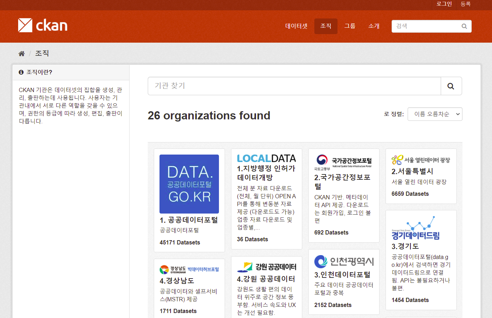
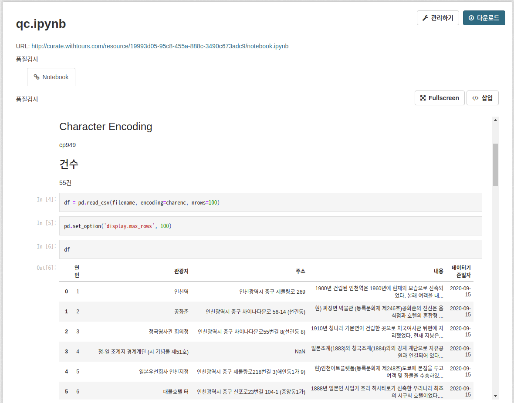
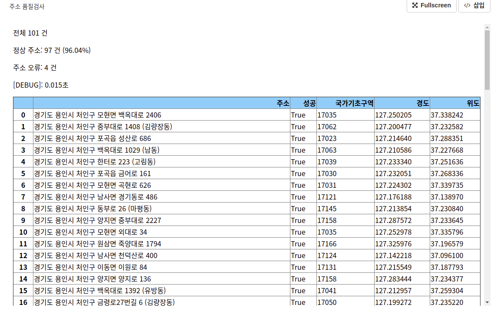
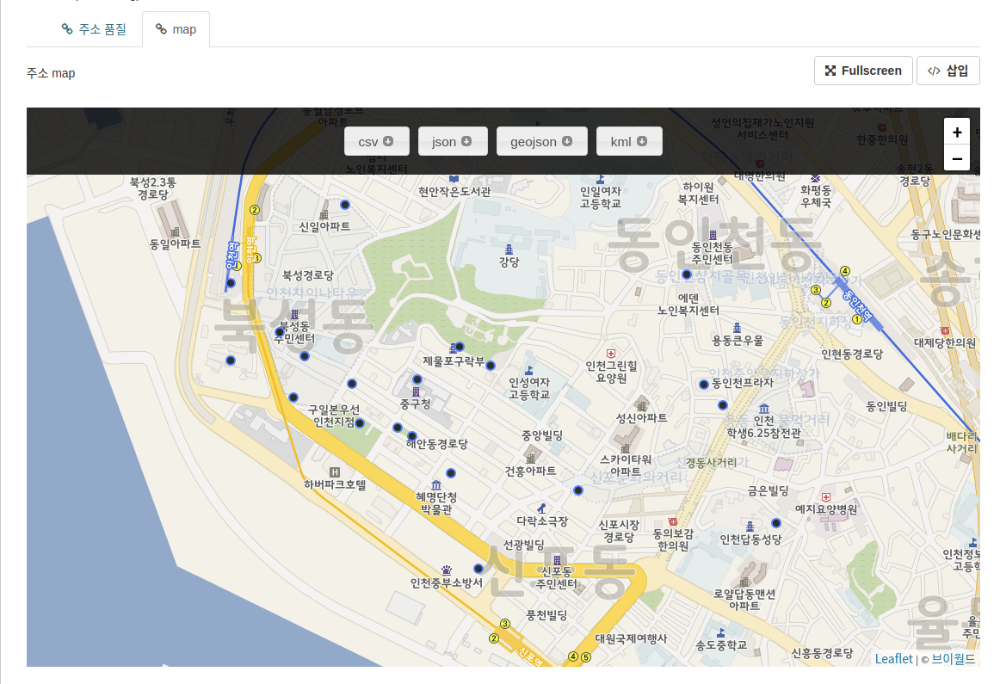

# [대한민국 공공데이터 서비스](http://www.gimi9.com) 

바로가기: http://www.gimi9.com

공공데이터 검색 서비스입니다.
[CKAN](https://ckan.org/)을 기반으로 합니다.

주 1회 업데이트 합니다.



## 2021년 10월

* 기관 추가: AI 허브
* 기관 추가: 데이터 스토어
* 기관 추가: 쿠콘
* 기관 추가: 카톨릭빅데이터통합센터
* 기관 추가: 한국관광 Data Lab
* 기관 추가: 무역투자 빅데이터 서비스
* 홈페이지 디자인 개선

1. 1.공공데이터포털	(48,435 데이터셋)
1. 1.지방행정 인허가 데이터개방	(36 데이터셋)
1. 2.국가공간정보포털	(793 데이터셋)
1. 2.서울특별시	(7,097 데이터셋)
1. 3.경기도	(1,488 데이터셋)
1. 3.인천데이터포털	(2,557 데이터셋)
1. 4.강원 공공데이터	(501 데이터셋)
1. 4.경상남도	(2,180 데이터셋)
1. 4.경상북도 공공데이터	(315 데이터셋)
1. 4.대구 D-데이터허브	(9,698 데이터셋)
1. 4.부산 공공데이터 포털	(2,558 데이터셋)
1. 4.전라북도 빅데이터 허브	(1,926 데이터셋)
1. 4.제주데이터허브	(833 데이터셋)
1. 8.LH 택지정보	(17 데이터셋)
1. 9.교통 빅데이터 플랫폼	(293 데이터셋)
1. 9.금융 빅데이터 플랫폼	(680 데이터셋)
1. 9.산림 빅데이터 플랫폼	(657 데이터셋)
1. AI 허브	(190 데이터셋)
1. 기미나인	(4 데이터셋)
1. 농식품 빅데이터	(265 데이터셋)
1. 데이터 스토어	(2,507 데이터셋)
1. 디지털 산업혁신 빅데이터	(517 데이터셋)
1. 라이프로그 빅데이터	(418 데이터셋)
1. 무역투자 빅데이터 서비스	(10 데이터셋)
1. 문화 빅데이터 플랫폼	(1,808 데이터셋)
1. 소방안전 빅데이터	(755 데이터셋)
1. 스마트치안 빅데이터	(160 데이터셋)
1. 유통 빅데이터 플랫폼	(24,746 데이터셋)
1. 중소기업 빅데이터 플랫폼	(689 데이터셋)
1. 지역경제 빅데이터 플랫폼	(1,073 데이터셋)
1. 카톨릭빅데이터통합센터	(64 데이터셋)
1. 쿠콘	(170 데이터셋)
1. 통신 빅데이터 플랫폼	(622 데이터셋)
1. 한국관광 Data Lab	(40 데이터셋)
1. 해양수산 빅데이터	(211 데이터셋)
1. 헬스케어 빅데이터 플랫폼	(4,088 데이터셋)
1. 환경 빅데이터 플랫폼	(2,445 데이터셋)


## 2021년 9월

* data-go-kr 사이트 변경에 따른 데이터 수집 수정
* 기미 버전(최종 Profile Report 생성일) 제공
* 미리보기 10건에서 20건으로 변경 및 작은 개선
* Python Notebook 보기를 Profile Report로 대체
* 큰 파일의 기미 제공
* Notebook, Map Tag 제거


1. 1.공공데이터포털	(48,071 데이터셋)
1. 1.지방행정 인허가 데이터개방	(36 데이터셋)
1. 2.국가공간정보포털	(793 데이터셋)
1. 2.서울특별시	(7,087 데이터셋)
1. 3.경기도	(1,485 데이터셋)
1. 3.인천데이터포털	(2,023 데이터셋)
1. 4.강원 공공데이터	(501 데이터셋)
1. 4.경상남도	(1,985 데이터셋)
1. 4.경상북도 공공데이터	(315 데이터셋)
1. 4.대구 D-데이터허브	(9,126 데이터셋)
1. 4.부산 공공데이터 포털	(2,527 데이터셋)
1. 4.전라북도 빅데이터 허브	(1,917 데이터셋)
1. 4.제주데이터허브	(801 데이터셋)
1. 8.LH 택지정보	(17 데이터셋)
1. 9.교통 빅데이터 플랫폼	(280 데이터셋)
1. 9.금융 빅데이터 플랫폼	(402 데이터셋)
1. 9.산림 빅데이터 플랫폼	(619 데이터셋)
1. 기미나인	(4 데이터셋)
1. 농식품 빅데이터	(191 데이터셋)
1. 디지털 산업혁신 빅데이터	(326 데이터셋)
1. 라이프로그 빅데이터	(164 데이터셋)
1. 문화 빅데이터 플랫폼	(1,730 데이터셋)
1. 소방안전 빅데이터	(734 데이터셋)
1. 스마트치안 빅데이터	(155 데이터셋)
1. 유통 빅데이터 플랫폼	(14,533 데이터셋)
1. 중소기업 빅데이터 플랫폼	(677 데이터셋)
1. 지역경제 빅데이터 플랫폼	(1,041 데이터셋)
1. 통신 빅데이터 플랫폼	(587 데이터셋)
1. 해양수산 빅데이터	(130 데이터셋)
1. 헬스케어 빅데이터 플랫폼	(3,283 데이터셋)
1. 환경 빅데이터 플랫폼	(1,572 데이터셋)


## 2021년 8월

* resource download link URL을 보이지 않고 짧게 "다운로드"로 표시
* resource view에 기미 요청 링크 추가
* 오래된 파일 리소스의 cache로 인한 기미 업데이터 버그 수정
* 서울시 FILE download link 오류 수정
* 데이터셋 명칭 개선: 예로 **도서관 현황(개방표준)** 을 **경기도 - 도서관 현황(개방표준)** 으로 변경하여 경기도의 데이터라는 것을 알 수 있음
* 미리보기 시스템 오류(디렉토리 권한) 수정
* 서울시 LINK를 제공하는 공공데이터포털의 데이터셋 삭제

1. 1.공공데이터포털	(48,271 데이터셋)
1. 1.지방행정 인허가 데이터개방	(36 데이터셋)
1. 2.국가공간정보포털	(793 데이터셋)
1. 2.서울특별시	(7,069 데이터셋)
1. 3.경기도	(1,474 데이터셋)
1. 3.인천데이터포털	(1,739 데이터셋)
1. 4.강원 공공데이터	(501 데이터셋)
1. 4.경상남도	(1,944 데이터셋)
1. 4.경상북도 공공데이터	(315 데이터셋)
1. 4.대구 D-데이터허브	(8,832 데이터셋)
1. 4.부산 공공데이터 포털	(2,474 데이터셋)
1. 4.전라북도 빅데이터 허브	(1,917 데이터셋)
1. 4.제주데이터허브	(778 데이터셋)
1. 8.LH 택지정보	(17 데이터셋)
1. 9.교통 빅데이터 플랫폼	(280 데이터셋)
1. 9.금융 빅데이터 플랫폼	(402 데이터셋)
1. 9.산림 빅데이터 플랫폼	(619 데이터셋)
1. 기미나인	(4 데이터셋)
1. 농식품 빅데이터	(191 데이터셋)
1. 디지털 산업혁신 빅데이터	(326 데이터셋)
1. 라이프로그 빅데이터	(164 데이터셋)
1. 문화 빅데이터 플랫폼	(1,730 데이터셋)
1. 소방안전 빅데이터	(734 데이터셋)
1. 스마트치안 빅데이터	(155 데이터셋)
1. 유통 빅데이터 플랫폼	(14,533 데이터셋)
1. 중소기업 빅데이터 플랫폼	(677 데이터셋)
1. 지역경제 빅데이터 플랫폼	(1,041 데이터셋)
1. 통신 빅데이터 플랫폼	(587 데이터셋)
1. 해양수산 빅데이터	(130 데이터셋)
1. 헬스케어 빅데이터 플랫폼	(3,283 데이터셋)
1. 환경 빅데이터 플랫폼	(1,572 데이터셋)

## 2021년 7월

* Pandas Profile report 추가
* zip 파일 미리보기
* 산림 빅데이터 플랫폼 샘플 이미지 미리보기
* 교통 빅데이터 플랫폼 샘플 데이터 보기
* [대구 D-데이터허브 ](http://data.daegu.go.kr/open/introduce/siteIntro.do) 사이트 개편 반영
* [인천데이터포털](https://www.incheon.go.kr/data/index) 데이터셋 분류(공공데이터포털, 자체포털) 반영
* [제주데이터허브](https://www.jejudatahub.net/) 추가

1. 1.공공데이터포털	(48,597 데이터셋)
1. 1.지방행정 인허가 데이터개방	(36 데이터셋)
1. 2.국가공간정보포털	(771 데이터셋)
1. 2.서울특별시	(7,064 데이터셋)
1. 3.경기도	(1,468 데이터셋)
1. 3.인천데이터포털	(1,739 데이터셋)
1. 4.강원 공공데이터	(501 데이터셋)
1. 4.경상남도	(1,872 데이터셋)
1. 4.경상북도 공공데이터	(294 데이터셋)
1. 4.대구 D-데이터허브	(8,184 데이터셋)
1. 4.부산 공공데이터 포털	(2,431 데이터셋)
1. 4.전라북도 빅데이터 허브	(1,914 데이터셋)
1. 4.제주데이터허브	(730 데이터셋)
1. 8.LH 택지정보	(17 데이터셋)
1. 9.교통 빅데이터 플랫폼	(280 데이터셋)
1. 9.금융 빅데이터 플랫폼	(402 데이터셋)
1. 9.산림 빅데이터 플랫폼	(619 데이터셋)
1. Department of Health	(1 데이터셋)
1. NHS Southwark CCG	(1 데이터셋)
1. NHS Wirral CCG	(1 데이터셋)
1. National Health Service	(1 데이터셋)
1. 기미나인	(4 데이터셋)
1. 농식품 빅데이터	(191 데이터셋)
1. 디지털 산업혁신 빅데이터	(326 데이터셋)
1. 라이프로그 빅데이터	(164 데이터셋)
1. 문화 빅데이터 플랫폼	(1,730 데이터셋)
1. 소방안전 빅데이터	(734 데이터셋)
1. 스마트치안 빅데이터	(155 데이터셋)
1. 유통 빅데이터 플랫폼	(14,533 데이터셋)
1. 중소기업 빅데이터 플랫폼	(677 데이터셋)
1. 지역경제 빅데이터 플랫폼	(1,041 데이터셋)
1. 통신 빅데이터 플랫폼	(587 데이터셋)
1. 해양수산 빅데이터	(130 데이터셋)
1. 헬스케어 빅데이터 플랫폼	(3,283 데이터셋)
1. 환경 빅데이터 플랫폼	(1,572 데이터셋)


## 2021년 6월

### 새로운 기능

* "위치" 그룹 추가: 주소를 포함하는 데이터셋 18,346건 등록
* 미리 보기: CSV, 아래한글(.hwp), 엑셀(.xlsx, .xls), JSON, XML
* qc 샘플링 건수 증가: 100건 -> 3000건

1. 1.공공데이터포털	(47,886 데이터셋)
1. 1.지방행정 인허가 데이터개방	(36 데이터셋)
1. 2.국가공간정보포털	(692 데이터셋)
1. 2.서울특별시	(7,055 데이터셋)
1. 3.경기도	(1,468 데이터셋)
1. 3.인천데이터포털	(2,358 데이터셋)
1. 4.강원 공공데이터	(501 데이터셋)
1. 4.경상남도	(1,843 데이터셋)
1. 4.경상북도 공공데이터	(294 데이터셋)
1. 4.대구 D-데이터허브	(5,241 데이터셋)
1. 4.부산 공공데이터 포털	(2,370 데이터셋)
1. 4.전라북도 빅데이터 허브	(1,874 데이터셋)
1. 8.LH 택지정보	(17 데이터셋)
1. 9.교통 빅데이터 플랫폼	(450 데이터셋)
1. 9.금융 빅데이터 플랫폼	(402 데이터셋)
1. 9.산림 빅데이터 플랫폼	(1,315 데이터셋)
1. 농식품 빅데이터	(190 데이터셋)
1. 디지털 산업혁신 빅데이터	(277 데이터셋)
1. 라이프로그 빅데이터	(164 데이터셋)
1. 문화 빅데이터 플랫폼	(1,730 데이터셋)
1. 소방안전 빅데이터	(734 데이터셋)
1. 스마트치안 빅데이터	(155 데이터셋)
1. 유통 빅데이터 플랫폼	(14,510 데이터셋)
1. 중소기업 빅데이터 플랫폼	(677 데이터셋)
1. 지역경제 빅데이터 플랫폼	(1,041 데이터셋)
1. 통신 빅데이터 플랫폼	(587 데이터셋)
1. 해양수산 빅데이터	(130 데이터셋)
1. 헬스케어 빅데이터 플랫폼	(3,283 데이터셋)
1. 환경 빅데이터 플랫폼	(1,572 데이터셋)

## 2021년 5월

### 새로운 기능

* 농식품 빅데이터 플랫폼 추가
* 디지털 산업혁신 빅데이터 플랫폼 추가
* 라이프로그 빅데이터 플랫폼 추가
* 소방안전 빅데이터 플랫폼 추가
* 스마트치안 빅데이터 플랫폼 추가
* 해양수산 빅데이터 플랫폼 추가

* 제공 중단된 데이터셋 제거

* Jupyter Notebook 보기


* 주소 품질 평가


* 지도 보기


1. 1.공공데이터포털	(47,184 데이터셋)
1. 1.지방행정 인허가 데이터개방	(36 데이터셋)
1. 2.국가공간정보포털	(692 데이터셋)
1. 2.서울특별시	(7,031 데이터셋)
1. 3.경기도	(1,463 데이터셋)
1. 3.인천데이터포털	(2,283 데이터셋)
1. 4.강원 공공데이터	(501 데이터셋)
1. 4.경상남도	(1,825 데이터셋)
1. 4.경상북도 공공데이터	(294 데이터셋)
1. 4.대구 D-데이터허브	(2,768 데이터셋)
1. 4.부산 공공데이터 포털	(2,280 데이터셋)
1. 4.전라북도 빅데이터 허브	(1,873 데이터셋)
1. 8.LH 택지정보	(17 데이터셋)
1. 9.교통 빅데이터 플랫폼	(449 데이터셋)
1. 9.금융 빅데이터 플랫폼	(402 데이터셋)
1. 9.산림 빅데이터 플랫폼	(1,127 데이터셋)
1. 농식품 빅데이터	(190 데이터셋)
1. 디지털 산업혁신 빅데이터	(270 데이터셋)
1. 라이프로그 빅데이터	(160 데이터셋)
1. 문화 빅데이터 플랫폼	(1,718 데이터셋)
1. 소방안전 빅데이터 플랫폼	(730 데이터셋)
1. 스마트치안 빅데이터	(150 데이터셋)
1. 유통 빅데이터 플랫폼	(13,902 데이터셋)
1. 중소기업 빅데이터 플랫폼	(677 데이터셋)
1. 지역경제 빅데이터 플랫폼	(1,041 데이터셋)
1. 통신 빅데이터 플랫폼	(556 데이터셋)
1. 해양수산 빅데이터	(130 데이터셋)
1. 헬스케어 빅데이터 플랫폼	(3,282 데이터셋)
1. 환경 빅데이터 플랫폼	(1,571 데이터셋)


## 2021년 4월

1. 1.공공데이터포털	(46,976 데이터셋)
1. 1.지방행정 인허가 데이터개방	(36 데이터셋)
1. 2.국가공간정보포털	(692 데이터셋)
1. 2.서울특별시	(6,769 데이터셋)
1. 3.경기도	(1,460 데이터셋)
1. 3.인천데이터포털	(2,221 데이터셋)
1. 4.강원 공공데이터	(501 데이터셋)
1. 4.경상남도	(1,813 데이터셋)
1. 4.경상북도 공공데이터	(294 데이터셋)
1. 4.대구 D-데이터허브	(2,763 데이터셋)
1. 4.부산 공공데이터 포털	(2,269 데이터셋)
1. 4.울산 공공데이터 포털	(683 데이터셋)
1. 4.전라북도 빅데이터 허브	(1,871 데이터셋)
1. 8.LH 택지정보	(17 데이터셋)
1. 9.교통 빅데이터 플랫폼	(422 데이터셋)
1. 9.금융 빅데이터 플랫폼	(402 데이터셋)
1. 9.산림 빅데이터 플랫폼	(1,127 데이터셋)
1. 문화 빅데이터 플랫폼	(1,718 데이터셋)
1. 유통 빅데이터 플랫폼	(12,496 데이터셋)
1. 중소기업 빅데이터 플랫폼	(647 데이터셋)
1. 지역경제 빅데이터 플랫폼	(1,018 데이터셋)
1. 통신 빅데이터 플랫폼	(556 데이터셋)
1. 헬스케어 빅데이터 플랫폼	(3,277 데이터셋)
1. 환경 빅데이터 플랫폼	(1,283 데이터셋)


## 2021년 3월

* 한글 검색 개선
* 공공데이터 포털의 파일 다운로드 오류 수정
* 표준데이터(공공데이터 포털) 그룹 추가
* DCAT 추가
```
# 전체 카탈로그 조회
http://data.withtours.com/catalog.rdf?page=1
http://data.withtours.com/catalog.jsonld?page=1

# 데이터셋의 rdf 조회
http://data.withtours.com/dataset/www-data-go-kr-data-filedata-15048620.rdf
http://data.withtours.com/dataset/www-data-go-kr-data-filedata-15048620.jsonld
http://data.withtours.com/dataset/www-data-go-kr-data-filedata-15048620.xml
```

1. 1.공공데이터포털	(45,462 데이터셋)
1. 1.지방행정 인허가 데이터개방	(36 데이터셋)
1. 2.국가공간정보포털	(692 데이터셋)
1. 2.서울특별시	(6,668 데이터셋)
1. 3.경기도	(1,455 데이터셋)
1. 3.인천데이터포털	(2,152 데이터셋)
1. 4.강원 공공데이터	(499 데이터셋)
1. 4.경상남도	(1,712 데이터셋)
1. 4.경상북도 공공데이터	(294 데이터셋)
1. 4.대구 D-데이터허브	(2,757 데이터셋)
1. 4.부산 공공데이터 포털	(2,143 데이터셋)
1. 4.울산 공공데이터 포털	(683 데이터셋)
1. 4.전라북도 빅데이터 허브	(1,868 데이터셋)
1. 8.LH 택지정보	(17 데이터셋)
1. 9.교통 빅데이터 플랫폼	(357 데이터셋)
1. 9.금융 빅데이터 플랫폼	(398 데이터셋)
1. 9.산림 빅데이터 플랫폼	(1,127 데이터셋)
1. 문화 빅데이터 플랫폼	(1,717 데이터셋)
1. 유통 빅데이터 플랫폼	(12,496 데이터셋)
1. 중소기업 빅데이터 플랫폼	(645 데이터셋)
1. 지역경제 빅데이터 플랫폼	(944 데이터셋)
1. 통신 빅데이터 플랫폼	(550 데이터셋)
1. 헬스케어 빅데이터 플랫폼	(2,147 데이터셋)
1. 환경 빅데이터 플랫폼	(1,282 데이터셋)


## 2021년 2월

1. 공공데이터포털 (44,555 데이터셋)
1. 서울특별시 (6,652 데이터셋)
1. 유통 빅데이터 플랫폼 (12,488 데이터셋)
1. 대구 D-데이터허브(2,385 데이터셋)
1. 부산 공공데이터 포털 (2,119 데이터셋)
1. 전라남도 공공데이터 커뮤니티 센터 (0 데이터셋)
1. 경상남도 (1,705 데이터셋)
1. 경기도 (1,438 데이터셋)
1. 인천데이터포털 (1,177 데이터셋)
1. 헬스케어 빅데이터 플랫폼 (2,143 데이터셋)
1. 문화 빅데이터 플랫폼 (1,714 데이터셋)
1. 국가공간정보포털 (692 데이터셋)
1. 환경 빅데이터 플랫폼 (1,274 데이터셋)
1. 울산 공공데이터 포털 (683 데이터셋)
1. 산림 빅데이터 플랫폼 (1122 데이터셋)
1. 강원 공공데이터(465 데이터셋)
1. 지역경제 빅데이터 플랫폼 (914 데이터셋)
1. 경상북도 공공데이터(294 데이터셋)
1. 중소기업 빅데이터 플랫폼 (645 데이터셋)
1. 교통 빅데이터 플랫폼 (356 데이터셋)
1. 금융 빅데이터 플랫폼 (397 데이터셋)
1. 통신 빅데이터 플랫폼 (547 데이터셋)
1. 지방행정 인허가 데이터개방 (36 데이터셋)
1. 택지정보시스템 (17 데이터셋)
1. 전라북도 빅데이터 허브 (1864 데이터셋)

## 2021년 1월

1. 공공데이터포털 (44,361건)
1. 서울특별시 (6,604건)
1. 유통 빅데이터 플랫폼 (6,130건)
1. 대구 D-데이터허브(2,575건)
1. 부산 공공데이터 포털 (2,118건)
1. 전라남도 공공데이터 커뮤니티 센터 (1,862건)
1. 경상남도 (1,701건)
1. 경기도 (1,442건)
1. 인천데이터포털 (1,178건)
1. 헬스케어 빅데이터 플랫폼 (1,169건)
1. 문화 빅데이터 플랫폼 (812건)
1. 국가공간정보포털 (755건)
1. 환경 빅데이터 플랫폼 (732건)
1. 울산 공공데이터 포털 (685건)
1. 산림 빅데이터 플랫폼 (593건)
1. 강원 공공데이터(501건)
1. 지역경제 빅데이터 플랫폼 (429건)
1. 경상북도 공공데이터(295건)
1. 중소기업 빅데이터 플랫폼 (235건)
1. 교통 빅데이터 플랫폼 (195건)
1. 금융 빅데이터 플랫폼 (136건)
1. 통신 빅데이터 플랫폼 (131건)
1. 지방행정 인허가 데이터개방 (39건)
1. 택지정보시스템 (17건)
1. 전라북도 빅데이터 허브 (0건)

* 검토중: [통계청](https://mdis.kostat.go.kr/infoData/detailData.do?statsConfmNo=101001)
* 검토중: [SK 빅데이터 허브](https://www.bigdatahub.co.kr/index.do)
* 검토중: [데이터스토어](https://www.datastore.or.kr/)
* 검토중: [API스토어](https://www.apistore.co.kr/main.do)

원본 데이터셋의 URL과 파일 정보를 제공합니다.

파일명 정보를 제공하지 않는 곳이 있습니다(파일X).
원본 데이터셋 페이지에서 확인하세요.
