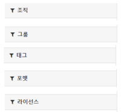

검색 결과에서 관심 있는 것들만 추려 볼 수 있어요.

[CKAN](ckan)이 제공하는 꽤 좋은 기능인데 잘 쓰지 않는 것 같아요.

예를 들어 "날씨"를 검색하면 300개 이상의 데이터셋이 나오는데요, 기상청이 제공하는 CSV만 보고 싶다면 이렇게 해보세요.

1. 태그 중 기상청을 선택: 53건으로 줄어들고,
2. 포맷 중 CSV를 선택: 2건으로 줄어들어요.

## 필터 대상

### 필터 분류

* 조직
* 그룹: 위치 정보, API 등
* 태그
* 포맷: CSV, 엑셀 등
* 라이선스

### 필터 선택

필터 분류에서 선택할 수 있는 필터가 나열되어 있어요. 그리고 각 항목에 몇 건씩 들어있는지도 알 수 있죠.
클릭하면 해당 필터가 적용돼요.

## 필터링 결과

