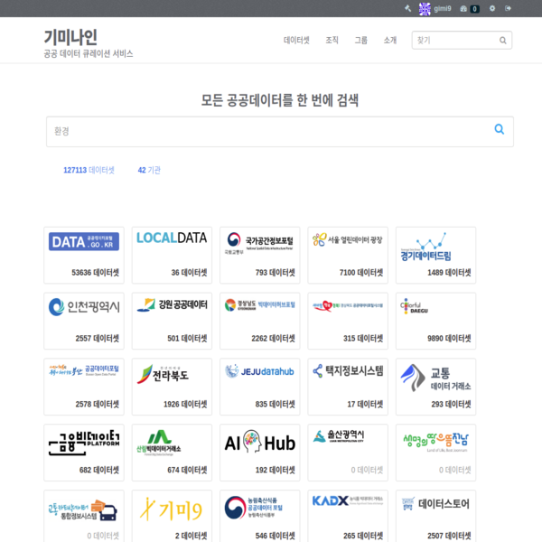

## 국가 지원으로 비용 부담 없이 데이터포털을 만드세요

기미나인의 데이터 수집, 전처리 가공, 분석, 공간 데이터, 시스템 개발 분야의 기술을 데이터 바우처 사업을 통해 제공합니다.

- 나에게 맞는 데이터를 찾아 드리는 "큐레이션 서비스"를 제공합니다.
- 공공데이터에 3만6천개의 지도가 포함되어 있습니다. GIS 데이터로 가공해 드립니다.
- 기업내에 데이터 포털을 만들고 싶다면, 세계적으로 가장 널리 사용되는 데이터포털 시스템인 CKAN 기반의 시스템을 이용해서 만들어 드립니다.
- 공공데이터 수집 서비스를 제공합니다. 소스코드를 함께 제공합니다.

### 3월 28일(화요일)까지 접수
[기미나인 데이터바우처 상품 안내 바로가기](http://kdata.or.kr/datavoucher/is/selectPortalFileDetail.do?rcpnYear=2023&brno=3778701405&sprnSctrCd=P01014002&prdcId=&sprnDsncCd=P11014001)

#### 편하게 문의하세요: gisman@gmail.com 윤태호팀장

